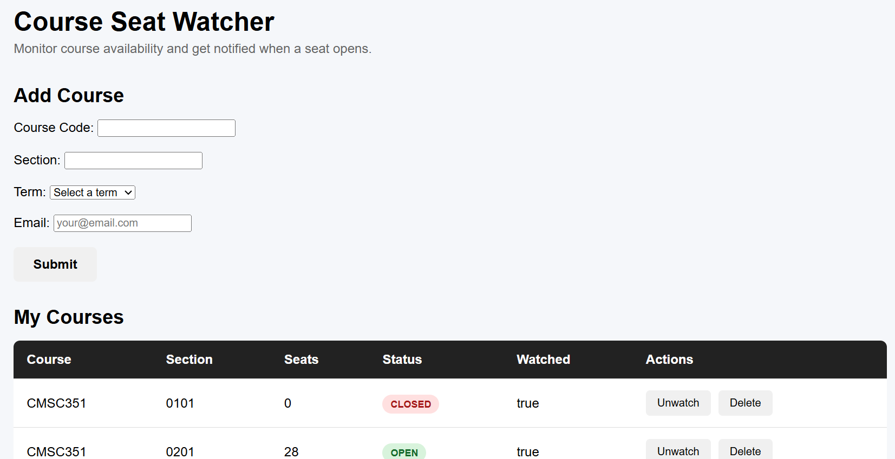

# Course Seat Watcher

Course Seat Watcher is a full-stack web application built with Java and Spring Boot that allows students to monitor UMD course seat availability and receive email notifications when seats become available.

## Live Demo

The application is deployed online with Railway.

https://course-seat-watcher-production.up.railway.app/
## Screenshot



## Features

- Retrieve live course and section availability from UMD Testudo
- Automatically retrieve available academic terms
- Add courses by course code, section, and term
- Automatically retrieve the current number of available seats
- Watch or unwatch courses
- Automatically monitor seat availability in the background
- Detect when a course changes from closed to open
- Send email notifications to subscribers when a seat becomes available
- Display helpful errors for invalid courses or sections
- Store course and subscriber data in PostgreSQL
- Manage courses through a Thymeleaf web interface
- Provide REST API endpoints for course management
- Unit testing with JUnit 5 and Mockito
- Cloud deployment with Railway

## Tech Stack

- Java 21
- Spring Boot
- Spring MVC
- Spring Data JPA
- PostgreSQL
- Thymeleaf
- Jsoup
- Spring Mail
- JUnit 5
- Mockito
- Maven
- Git / GitHub
- Railway

## Architecture

The application follows a layered Spring Boot architecture:

```text
Browser
   ↓
Thymeleaf Web Interface
   ↓
Spring MVC Controllers
   ↓
Service Layer
   ↓
Spring Data JPA
   ↓
PostgreSQL

CourseMonitorService
   ↓
Testudo Live Course Data
   ↓
Seat Change Detection
   ↓
Email Notification
```

A scheduled background service periodically retrieves live course information from UMD Testudo and checks watched courses for changes in seat availability. When a course changes from closed to open, the application sends an email notification to the subscriber.

### Main Components

- **CourseController** - Provides REST API endpoints for course operations
- **WebController** - Handles the Thymeleaf web interface
- **CourseService** - Contains course management logic
- **CourseScraperService** - Retrieves live course, section, seat, and term data from Testudo
- **CourseMonitorService** - Periodically monitors watched courses for seat changes
- **EmailService** - Sends seat availability notifications
- **CourseRepository** - Provides database access using Spring Data JPA

## REST API

| Method | Endpoint | Description |
|--------|----------|-------------|
| GET | `/courses` | Get all courses |
| GET | `/courses/{id}` | Get a course by ID |
| POST | `/courses` | Add a course |
| PUT | `/courses/{id}` | Update a course |
| DELETE | `/courses/{id}` | Delete a course |
| GET | `/courses/open` | Get courses with available seats |
| GET | `/courses/code/{courseCode}` | Search by course code |
| PUT | `/courses/{id}/watch` | Watch a course |
| PUT | `/courses/{id}/unwatch` | Stop watching a course |

## Configuration

The application uses environment variables to keep database and email credentials out of source control.

Required environment variables:

```text
DB_URL
DB_USERNAME
DB_PASSWORD
MAIL_USERNAME
MAIL_PASSWORD
```

For local development, PostgreSQL runs on localhost. In production, the application uses a Railway PostgreSQL database.

## Running Locally

1. Clone the repository.
2. Create a PostgreSQL database named `seatwatcher`.
3. Configure the required environment variables.
4. Run the Spring Boot application.
5. Open `http://localhost:8080` in your browser.

## Testing

The service layer includes unit tests using JUnit 5 and Mockito.

Tests cover:

- Retrieving all courses
- Finding courses by ID
- Handling courses that do not exist
- Adding courses
- Updating courses
- Deleting courses
- Retrieving open courses
- Updating watch status

Run the tests with:

```bash
./mvnw test
```

On Windows:

```bash
mvnw.cmd test
```

## Future Improvements

- Add user accounts and authentication
- Support multiple users with separate watchlists
- Add configurable notification preferences
- Support additional universities and course systems
- Improve monitoring and error handling